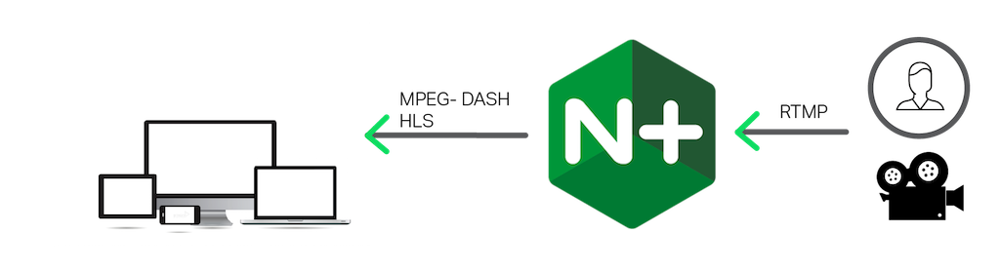

# Homework Assignment 2

Submission Deadline: February 28, 2024

This is an individual assignment to be conducted individually by each student.

## Video Streaming with NGINX 

In this assignment, you will create a Docker container that hosts NGINX along with the RTMP (Real-Time Messaging Protocol) module for media streaming. 
It can accept a live video feed via RTMP, and publish it to subscribers using both RTMP and HLS (HTTP Live Streaming).
This part aims to familiarize you with the process of containerizing applications and configuring NGINX with an additional module.
We expect you to already have a basic familiarity with Docker and NGINX. 



### Software 

You will find the code for this assignment in the directory `nginx`. 
Within the directory, you will find a partially completed `Dockerfile` that you need to finalize.
The Dockerfile creates a Docker image that can be used to instantiate an RTMP server for multimedia / video streaming using [Nginx](http://nginx.org/en/) and [nginx-rtmp-module](https://github.com/arut/nginx-rtmp-module), built from the current latest sources.
Within the directory, you will also find a configuration file `nginx.conf`, which configures NGNIX to stream video using the HLS protocol, and `video.html`, which builds a web video player upon the [video.js](https://videojs.com/) web video player framework.

### Building and deploying the NGINX Server

Create a single-node experiment on CloudLab using the `multi-node-cluster` profile in the `UCY-CS499-DC` project.

Finalize the partially completed `Dockerfile` by following the instructions labeled as `TODO` within the file. Add the necessary commands to build NGINX alongside the RTMP module.

After completing the Dockerfile, use the Docker command to build the Docker image.

Once the image is successfully built, run a Docker container based on the newly created image. Make sure you expose the relevant network ports for proper functionality.

### Testing the playback methods

For this assignment, you will stream from a file rather than live. You will start the video stream by running the following command:
, where `NGINX_server` is the IP address or hostname of your NGINX server:

```
ffmpeg -re -i BigBuckBunny_320x180.mp4 -vcodec libx264 -vprofile baseline -acodec aac -strict -2 -f flv rtmp:/NGINX_server/live/bbb
```

The video we are streaming (specified with the `-i` argument) is the open source [Big Buck Bunny](https://download.blender.org/peach/bigbuckbunny_movies/) video from blender.org. For details about the other arguments, see the [ffmpeg documentation](https://ffmpeg.org/ffmpeg.html).

Once video is streaming, you can test that NGINX is correctly serving it using the protocols you have configured. You can use the [VLC media player](https://www.videolan.org/vlc/) to access the appropriate URL for each playback method. For the HLS protocol, you can also access the corresponding URL directly from an HLS compatible web browser (e.g., Chrome, Edge, Safari, Firefox). In the URLs, `NGINX_server` is the IP address or hostname of the NGINX server:

- RTMP – `rtmp://NGINX_server/live/bbb`
- HLS – `http://NGINX_server/hls/bbb.m3u8`

Alternatively, you can use the provided web video player `video.html` to access the HLS URL. 
The web video player accepts a `url` parameter that points to the URL of the video stream. 

In your web browser's address bar, enter the following URL, where `NGINX_server` is the IP address or hostname of the NGINX server:

```
file://path/to/video.html?url=http://NGINX_server/hls/bbb.m3u8
```

---
**NOTE:** [OBS Studio](https://obsproject.com/) is a commonly used open source tool that allows you to livestream from your workstation to your NGINX server by configuring a custom RTMP server. You can configure OBS to stream to `rtmp://NGINX_server/tv/tv2`, where `NGINX_server` is the IP address or hostname of your NGINX server. No stream key is required.

---

### Submission

Now you need to submit your assignment. Commit your change and push it to the remote repository by doing the following:

```
$ git commit -am "[you fill me in]"
$ git push -u origin main
```

You may push you code as many times you like, grading and submission time will be based on your last push.
