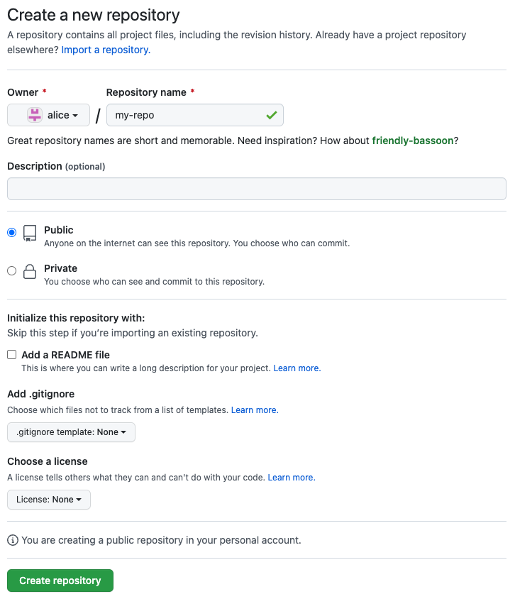

# Lab: Essential Tools

The purpose of this lab tutorial is to give you hands-on experience with a few essential tools that you will find helpful for this course.

## Prerequisites

### Setting up the Experiment Environment in Cloudlab

For this tutorial, you will be using a small CloudLab cluster. 

Start a new experiment on CloudLab using the `multi-node-cluster` profile in the `UCY-CS499-DC` project, configured with two (2) physical machine nodes. 

## Version Control: Git and GitHub

[Git](https://git-scm.com/) is a distributed version control system for managing source code. Version control is a system for tracking changes to files. As you modify files, the version control system records and saves each change. This allows you to restore a previous version of your code at any time.

[GitHub](https://github.com/) is a code hosting platform for version control and collaboration. It lets you and others work together on projects from anywhere. Go [there](https://github.com/signup) and create an account if you don’t have one. 

A typical workflow involves editing and working on your content in your local repository on your computer, and then sending your changes to the remote repository on GitHub.

### Getting started

Open a remote SSH terminal session to `node0`. Make sure you enable forwarding of the authentication agent connection.

Make sure you have already installed Git on your working machine (`node0`). To check if git is already installed, open the Terminal and hit:

```
git --version
```

To install the latest version of git:

```
sudo apt -y install git
```

### Working locally 

To use Git you will have to setup a repository. You can take an existing directory to make a Git repository, or create an empty directory.

```bash
# create a new directory, and initialize it with git-specific functions
git init my-repo

# change into the `my-repo` directory
cd my-repo

# create the first file in the project
touch README.md

# git isn't aware of the file, stage it
git add README.md

# take a snapshot of the staging area
git commit -m "add README to initial commit"
```

### Hosting your source code on GitHub

You need to [create](https://github.com/new) a repository for your project. **Do not** initialize the repository with a README, .gitignore or License file. This empty repository will await your code.

<figure>
  <p align="center"></p>
  <figcaption><p align="center">Figure. Creating a new GitHub repository </p></figcaption>
</figure>

Before you can push commits made on your local branch to a remote repository, you will need to provide the path for the repository you created on GitHub and rename your local branch.

#### Providing the path to the remote repository 

You can push commits made on your local branch to a remote repository identified by a remote URL. A remote URL is Git's fancy way of saying "the place where your code is stored". That URL could be your repository on GitHub, or another user's fork, or even on a completely different server.

You can only push to two types of URL addresses:
- An HTTPS URL like `https://github.com/user/repo.git`. The `https://` URLs are available on all repositories, regardless of visibility. `https://` URLs work even if you are behind a firewall or proxy.
- An SSH URL, like `git@github.com:user/repo.git`. SSH URLs provide access to a Git repository via SSH, a secure protocol. To use these URLs, you must generate an SSH keypair on your computer and add the public key to your account on GitHub.com. For more information, see [Connecting to GitHub with SSH](https://docs.github.com/en/github/authenticating-to-github/connecting-to-github-with-ssh).

You can use the git remote add command to match a remote URL with a name. For example, you'd type the following in the command line:

```
git remote add origin  <REMOTE_URL> 
```

This associates the name origin with the `REMOTE_URL`.

You can use the command `git remote set-url` to [change a remote's URL](https://docs.github.com/en/github/getting-started-with-github/managing-remote-repositories).

To provide the path for the repository you created on GitHub using the SSH URL:

```
git remote add origin git@github.com:YOUR-USERNAME/YOUR-REPOSITORY-NAME.git
```

#### Renaming the default branch

Every Git repository has an initial branch, which is the first branch to be created when a new repository is generated. Historically, the default name for this initial branch was `master`, but `main` is an increasingly popular choice. 

Since the default branch name for new repositories created on GitHub is now `main`, you will have to to rename your local `master` branch to `main`:

```
git branch -M main
```

#### Pushing and fetching changes

You're now setup to push changes to the remote repository:

```
git push -u origin main
```

If you're already setup for push as above, then the following will bring changes down and merge them in:

```
git pull
```

What this is doing under-the-hood is running a `git fetch` and then `git merge`.


### Cloning an existing repository

If you want to get a copy of an existing Git repository, the command you need is `git clone`.

For example, to get a copy of the course's repository using an HTTPS URL:

```
git clone https://github.com/ucy-coast/cs452-sp24.git
```

## Configuration Management: `parallel-ssh` and Ansible

### Run a command over SSH on a single machine

When the only thing you need to do over the SSH connection is execute a single quick command, you might not want to take the separate actions of connecting and authenticating, running the command, and then disconnecting.

SSH allows users to append the desired command directly to the connection attempt. The command executes, and the connection is closed.

The basic syntax is `ssh user@host "command"`.

For example, you could check the installation status of a package:

```
$ ssh alice@amd198.utah.cloudlab.us "dpkg -l | grep nano"
```

You can also run commands from a local file. The `-s` option of `bash` helps to read the executable command from the standard input:

```
ssh alice@amd198.utah.cloudlab.us 'bash -s' < src/get_host_info.sh
```

If you need to elevate your privileges on the far side of the SSH connection with `sudo`, then force the use of a pseudo-terminal with `-t`. Use this if `sudo` will challenge you for a password. The command looks like this:

```
$ ssh -t alice@amd198.utah.cloudlab.us "sudo apt -y install nano"
```

### Run a command over SSH on multiple machines 

For cluster sizes larger than 2, `parallel-ssh` and `ansible` are very useful tools for running the same commands on multiple machines.

Getting started with these tools is simple. 
1. Choose a machine as your management system and install the tool. Your management node can also be a managed node.
2. Ensure you have passwordless ssh access from your management system to each managed node.
3. Create a hosts file containing an inventory of your nodes.
4. Start using the tool 

We suggest the following:
- For step 1, you use `node0` as the management system.
- For step 2, you use a CloudLab profile that automatically sets up ssh keys for passwordless access. All the CloudLab profiles under `UCY-CS499-DC` meet this requirement.

#### Using `parallel-ssh`

[`parallel-ssh`](https://manpages.org/parallel-ssh) is a program for executing ssh in parallel on a number of hosts. 

On Debian based distributions, you can install `parallel-ssh` using `apt`:

```
$ sudo apt -y install pssh
```

To use `parallel-ssh`, you need to create a text file called hosts file that contains a list of all the hosts that you want to have the command executed on:

```
node0
node1
```

Once you have a hosts file, you can run `parallel-ssh` for all the hosts from this file to execute a command. You can use the `-i` option to display standard output and standard error as each host completes. 

For example, you can run `date` on each host:

```
$ parallel-ssh -i -h pssh_hosts date
```

Sample output:

```
[1] 06:48:49 [SUCCESS] node0
Wed Jul  6 06:48:49 CDT 2022
[2] 06:48:49 [SUCCESS] node1
Wed Jul  6 06:48:49 CDT 2022
```

As another example, you can run `apt` to install `nano` on each host:

```
$ parallel-ssh -i -h pssh_hosts -- sudo apt -y install nano
```

#### Using `ansible`

[Ansible](https://www.ansible.com/) is a modern configuration management tool that facilitates the task of setting up and maintaining remote servers. [Configuration management](https://en.wikipedia.org/wiki/Configuration_management) is an automated method for maintaining computer systems and software in a known, consistent state. 

<figure>
  <p align="center"></p>
  <figcaption><p align="center">Figure. Ansible Architecture</p></figcaption>
</figure>

On Debian based distributions, you can install `ansible` using `apt`:

```
sudo apt -y install ansible
```

Similarly to `parallel-ssh`, Ansible uses an inventory file, called hosts to determine which nodes you want to manage. This is a plain-text file which lists individual nodes or groups of nodes (e.g. Web servers, Database servers, etc.). 
The default location for the inventory file is /etc/ansible/hosts, but it’s possible to create inventory files in any location that better suits your needs. In this case, you’ll need to provide the path to your custom inventory file with the `-i` parameter when running Ansible commands. Using per-project inventory files is a good practice to minimize the risk of running a command on the wrong group of servers. A simple hosts file you can start off with looks like this:

```
[webservers]
node1
```

This defines a group of nodes we call `webservers` with two specified hosts in it.

We can now immediately launch Ansible to see if our setup works:

```
$ ansible webservers -i ./hosts -m ping
node1 | SUCCESS => {
    "changed": false, 
    "ping": "pong"
}
```

Ansible connects to each individual node in the group of webservers, transmits the required module (here: `ping`), launches the module, and returns the module’s output. Instead of addressing a group of nodes, we can also specify an individual node or a set of nodes with wildcards.

Modules use the available context to determine what actions if any needed to bring the managed host to the desired state and are [idempotent](https://en.wikipedia.org/wiki/Idempotence#Computer_science_meaning), that means if you run the same task again and again, the state of the machine will not change. To find the list of available modules, use `ansible-doc -l`

Instead of shooting off individual ansible commands, we can group these together into so-called playbooks which declare a specific configuration we want to apply to a node. Tasks specified are processed in the order we specify. A playbook is expressed in YAML:

```
---
- name: Configure webserver with nginx
  hosts: webservers
  vars:
    web_root: "{{ ansible_env.HOME }}/static-site"
  tasks:
    - name: install nginx
      apt: 
        name: nginx 
        update_cache: yes
      become: yes
    
    - name: copy the nginx config file
      template:
        src: static_site.cfg.j2
        dest: /etc/nginx/sites-available/static_site.cfg
      become: yes
    
    - name: create symlink
      file:
        src: /etc/nginx/sites-available/static_site.cfg
        dest: /etc/nginx/sites-enabled/default
        state: link
      become: yes

    - name: ensure {{ web_root }} dir exists
      file:
        path: "{{ web_root }}"
        state: directory

    - name: copy index.html
      copy: 
        src: index.html
        dest: "{{ web_root }}/index.html"

    - name: restart nginx
      service: 
        name: nginx 
        state: restarted
      become: yes
```

The format is very readable. 
With `hosts`, we choose specific hosts and/or groups in our inventory to execute against. 
With `vars`, we define variables we want to pass to tasks. These variables can be used within the playbook and within templates as `{{ var }}`. 
With `tasks`, we define the list of tasks we want to execute. Each task hask a name which helps us track playbook progress and a module we want Ansible to invoke.
Finally, for tasks that require root privileges such as installing packages, we use `become` to ask Ansible to activate privilege escalation and run corresponding tasks as `root` user. 

The playbook uses several types of modules, many of which are self explanatory. The template module construct a file’s content using variables. Ansible uses the [Jinja2](http://jinja.pocoo.org/docs/) templating language.

The `ansible-playbook` utility processes the playbook and instructs the nodes to perform the tasks, starting with an implicit invocation of the setup module, which collects system information for Ansible. Tasks are performed top-down and an error causes Ansible to stop processing tasks for that particular node.

```
ansible-playbook -i ./hosts nginx.yml
```

Once the playbook is finished, if you go to your browser and access `node1`'s public hostname or IP address you should see the following page:

```
nginx, configured by Ansible
If you can see this, Ansible successfully installed nginx.
```

Alternatively, you can use a `curl` command to GET a remote resource and have it displayed in the terminal:

```
curl http://node1/index.html
```

**Exercise**: Extend the nginx setup to display the node that the nginx service is running on. For example, when visiting `node1` you should get the following page: 

```
nginx, configured by Ansible
If you can see this, Ansible successfully installed nginx.
Running on node1.
```

## HTTP Benchmarking: `wrk`

Wrk is a modern HTTP benchmarking tool, which measures the latency of your HTTP services at high loads.

Latency refers to the time interval between the moment the request was made (by wrk) and the moment the response was received (from the service). This can be used to simulate the latency a visitor would experience on your site when visiting it using a browser or any other method that sends HTTP requests.

`wrk` is useful for testing any website or application that relies on HTTP, such as:
- Rails and other Ruby applications
- Express and other JavaScript applications
- PHP applications
- Static websites running on web servers
- Sites and applications behind load balancers like Nginx
- Your caching layer

Tests can’t be compared to real users, but they should give you a good estimate of expected latency so you can better plan your infrastructure. Tests can also give you insight into your performance bottlenecks.

You will use `wrk` to benchmark the static website running on the Ngnix web server configured in the previous section. You will run `wrk` on `node0`, which we refer to as the benchmarking machine. You should already be running the nginx web werver on `node1`, which we refer to as the application machine.

<figure>
  <p align="center"></p>
  <figcaption><p align="center">Figure. wrk benchmarking</p></figcaption>
</figure>

### Install wrk on benchmarking machine

On Debian based distributions, you can install `wrk` using `apt`:

```
sudo apt update
sudo apt -y install wrk
```

Alternatively, you can build `wrk` from source:

```
git clone https://github.com/wg/wrk.git
cd wrk
make -j
```

Passing flag `-j` to make starts make in parallel mode, which can significantly improve the performance of a build on modern multicore systems.

### Run a wrk benchmark test

The simplest case we could run with wrk is:

```
wrk -t2 -c6 -d5s --timeout 2s --latency http://node1/
```

Which means:

- `-t2`: Use two separate threads
- `-c6`: Open six connections (the first client is zero)
- `-d5s`: Run the test for five seconds
- `--timeout 2s`: Define a two-second timeout
- `--latency`: Print latency statistics  
- `http://node1/`: The target application is listening on `node1`
- Benchmark the `/` path of our application

This can also be described as six users that request our home page repeatedly for five seconds.

The illustration below shows this situation:

<figure>
  <p align="center"></p>
  <figcaption><p align="center">Figure. wrk benchmarking</p></figcaption>
</figure>

Wait a few seconds for the test to run, and look at the results, which we’ll analyze in the next step.

### Evaluate the output

Output:

```
Running 5s test @ http://node1/
  2 threads and 6 connections
  Thread Stats   Avg      Stdev     Max   +/- Stdev
    Latency   193.80us   54.14us   3.30ms   86.37%
    Req/Sec     9.91k   425.67    10.86k    72.55%
  Latency Distribution
     50%  175.00us
     75%  214.00us
     90%  257.00us
     99%  351.00us
  100509 requests in 5.10s, 43.03MB read
Requests/sec:  19707.66
Transfer/sec:      8.44MB
```

- Current configuration summary:

  ```
  Running 5s test @ http://node1/
    2 threads and 6 connections
  ```

  Here we can see a brief summary of our benchmark configuration. The benchmark took 5 seconds, the benchmarked machine hostname is `node1`, and the test used two threads.

- Normal distribution parameters for the latency and req/sec statistics:

  ```
    Thread Stats   Avg      Stdev     Max   +/- Stdev
      Latency   193.80us   54.14us   3.30ms   86.37%
      Req/Sec     9.91k   425.67    10.86k    72.55%
  ```

  This part shows us the normal distribution details for our benchmark - what parameters a Gaussian function would have.

  Benchmarks don’t always have normal distributions, and that’s why these results might be misleading. Therefore always look at the Max and +/- Stdev values. If those values are high, then you can expect that your distribution might have a heavy tail.

- Percentile latency statistics:

  ```
    Latency Distribution
      50%  175.00us
      75%  214.00us
      90%  257.00us
      99%  351.00us
  ```

  Here we can see the 50%, 75%, 90% and 99% latency percentiles. For example, the 99th percentile latency represents the maximum latency, in seconds, for the fastest 99% of requests. Here, nginx processed 99% of requests in less than 351.00 microseconds. 
  
  Since averages can be misleading, latency percentiles can be very useful when interpreting system performance and tail latency. 

- Statistics about the request numbers, transferred data, and throughput:

  ```
    100509 requests in 5.10s, 43.03MB read
  Requests/sec:  19707.66
  Transfer/sec:      8.44MB
  ```

  Here we see that during the time of 5.1 seconds, wrk could do 100509 requests and transfer 43.03MB of data. Combined with simple math (total number of requrests/benchmark duration) we get the result of 19707.66 requests per second.
