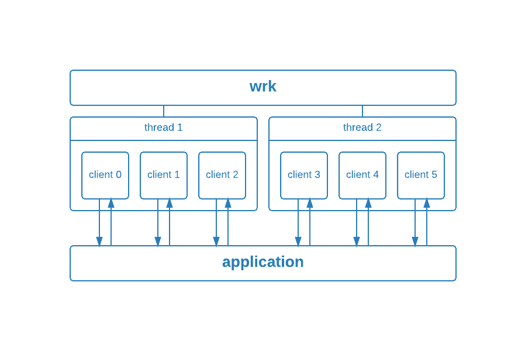

# Lab: Scaling Docker Containers

In this lab tutorial, you will gain hands-on experience in deploying and scaling out a three-tier web application on a cluster. 
This will be achieved through Docker Compose and Docker Swarm, two powerful tools that streamline the process of container orchestration.

## Prerequisites

### Setting up the Experiment Environment in Cloudlab

For this tutorial, you will be using a CloudLab profile that comes with the Docker Engine installed.

Start a new experiment on CloudLab using the `multi-node-cluster` profile in the `UCY-CS499-DC` project, configured with at least two physical machine nodes. 

When your experiment is ready to use, log into the machine, and verify that Docker Engine is installed correctly by running the hello-world image.

```
$ sudo docker run hello-world
Unable to find image 'hello-world:latest' locally
latest: Pulling from library/hello-world
03f4658f8b78: Pull complete
a3ed95caeb02: Pull complete
Digest: sha256:8be990ef2aeb16dbcb9271ddfe2610fa6658d13f6dfb8bc72074cc1ca36966a7
Status: Downloaded newer image for hello-world:latest

Hello from Docker.
This message shows that your installation appears to be working correctly.
...
```

If you haven't already, please go ahead and clone the repository on `node0` like so:

```
$ git clone https://github.com/ucy-coast/cs452-sp24.git
$ cd cs452-sp24/labs/04-scaling/scaledemo
```

## Docker Compose

[Docker Compose](https://github.com/docker/compose) is a tool for defining and running multi-container Docker applications. 
It allows you to describe the services, networks, and volumes for a multi-container application in a single file, typically named `docker-compose.yml`. 
With Docker Compose, you can define a group of interconnected containers, their configurations, and the relationships between them, making it easier to manage complex applications.

### Understanding docker-compose.yml

The directory contains a `docker-compose.yml` file, defined using the Docker Compose file format. A Compose file is used to define how the one or more containers that make up your application are configured.

Let's now have a quick look at the `docker-compose.yml` file:

```yaml
version: "3"

services:
  web:
    image: localhost:5000/web
    build: .
    deploy:
      mode: replicated
      replicas: 1
    ports:
      - "8000"
    restart: always
  redis:
    image: redis:alpine
    restart: always
  nginx:
    image: nginx:latest
    volumes:
      - ./nginx.conf:/etc/nginx/nginx.conf:ro
    depends_on:
      - web
    ports:
      - 8080:8080
    restart: always
```

The compose file defines three services each of them corresponding to one container:
- `nginx`: Creates a load balancer based on [NGINX](https://www.nginx.com/) that balances requests among the various `web` instances.
- `web`: Creates a web server that replies with a hello message including a counter, which increments with each reply.
- `redis`: Creates a data store tasked with maintaining a counter for each web server instance.

<figure>
  <p align="center"></p>
  <figcaption><p align="center">Figure. Three-tier application</p></figcaption>
</figure>

For each service, the compose file specifies the following:
- `build`: Specifies the directory containing the Dockerfile that builds the profile image.
- `image`: Specifies the image to start the container from. Since the service specifies an `image` as well as `build`, Docker Compose names the built image with the name specified in image. An image name is made up of slash-separated name components, optionally prefixed by a container registry.
- `entrypoint`: Sets the command and parameters that will be executed first when a container is run.
- `container_name`: Sets the actual name of the container when it runs, rather than letting Docker Compose generate it. 
- `ports`: Exposes specified container ports.
- `restart`: Specifies the container restart policy.

For each service, the compose file can specify an image statement and/or a build statement: 
- An image statement specifies the image to start the container from. For example, we have a `redis` service that uses an existing image `redis:alpine` from a container registry. 
- A build statement specifies the build configuration for creating container image from source, using a Dockerfile contained in the directory indicated by the build statement. For example, for the `web` service, we have a `build: .`, which means the current working directory contains a Dockerfile that specifies how to build the `localhost:5000/web` image. 
- When the service specifies an image as well as a build, Docker Compose names the built image with the name specified in image. For example, for the `web` service, we have an `image: localhost:5000/web` in addition to `build: .`, which means Docker Compose will name the built image as `web` and associate it with the `localhost:5000` registry. 

Once you have a Compose file, you can create and start your application with a single command `docker-compose up`.  

### Deploying services

We are now ready to run our app by invoking:

```
docker-compose up
```

Compose tells Docker to start all the containers and displays aggregated logs.

```
Creating scaledemo_web_1   ... done
Creating scaledemo_redis_1 ... done
Creating scaledemo_nginx_1 ... done
...
redis_1  | 1:C 29 Dec 2023 08:04:46.807 * oO0OoO0OoO0Oo Redis is starting oO0OoO0OoO0Oo
web_1    |  * Running on all addresses (0.0.0.0)
...
```

Check that the application is running with `docker compose ps`:

```
Name                Command                          State   Ports
-------------------------------------------------------------------------------------------
scaledemo_nginx_1   nginx -g daemon off;             Up      80/tcp, 0.0.0.0:8080->8080/tcp
scaledemo_redis_1   docker-entrypoint.sh redis ...   Up      6379/tcp
scaledemo_web_1     python app.py                    Up      0.0.0.0:32857->8000
```

You can also test the application with `curl`:

```
$ curl http://node0:8080
Hello World from container 60c3761497bf ! I have been seen 1 times.

$ curl http://node0:8080
Hello World from container 60c3761497bf ! I have been seen 2 times.

$ curl http://node0:8080
Hello World from container 60c3761497bf ! I have been seen 3 times.
```

Bring the app down:

```
$ docker compose down --volumes

Stopping scaledemo_nginx_1 ... done
Stopping scaledemo_web_1   ... done
Stopping scaledemo_redis_1 ... done
Removing scaledemo_nginx_1 ... done
Removing scaledemo_web_1   ... done
Removing scaledemo_redis_1 ... done
Removing network scaledemo_default
```

### Scaling service instances

Each service defined in Docker compose configuration can be scaled by using the `up` command together with the `--scale` flag.

Scale the `web` service by starting two container instances: 

```
docker-compose up --scale web=2
```

Test the application with `curl`:

```
$ curl http://node0:8080
Hello World from container 52a4a785dd29 ! I have been seen 1 times.

$ curl http://node0:8080
Hello World from container 17f526823085 ! I have been seen 1 times.

$ curl http://node0:8080
Hello World from container 52a4a785dd29 ! I have been seen 2 times.

$ curl http://node0:8080
Hello World from container 17f526823085 ! I have been seen 2 times.
```

As you can see, the load balancer round robins requests among the two web service instances.

Although Docker Compose allows for running multiple instances of a service, it's important to highlight that all these instances operate on a single node. For deploying multiple instances across the nodes of a cluster, we will use Docker Swarm.

## Docker Swarm

Docker Swarm is a container orchestration tool provided by Docker. It allows users to create and manage a swarm of Docker nodes, turning them into a single, virtual Docker host. This enables the orchestration of containers across multiple machines, making it easier to deploy, scale, and manage applications in a distributed environment.

### Creating up a Swarm cluster

Open a terminal and ssh into the machine where you want to run your manager node. This tutorial uses a machine named `node0`.

Run the following command to create a new swarm:

```
docker swarm init --advertise-addr <MANAGER-IP>
```

In the tutorial, the following command creates a swarm on the ``node0`` machine:

```
$ docker swarm init --advertise-addr 10.10.1.1

Swarm initialized: current node (ap1wu0wv0lcqrphpg18vxdccr) is now a manager.

To add a worker to this swarm, run the following command:

    docker swarm join --token SWMTKN-1-344glh9yboz8g8f7t8co37rewjxr3u8vl2xdjmnvkiw460iom9-dwlr9j6aqcahc28n2betddx24 10.10.1.1:2377

To add a manager to this swarm, run 'docker swarm join-token manager' and follow the instructions.
```

The output includes the commands to join new nodes to the swarm. Nodes will join as managers or workers depending on the value for the `--token` flag.

Run `docker info` to view the current state of the swarm:

```
Containers: 2
Running: 0
Paused: 0
Stopped: 2
  ...snip...
Swarm: active
  NodeID: dxn1zf6l61qsb1josjja83ngz
  Is Manager: true
  Managers: 1
  Nodes: 1
  ...snip...
```

Run the `docker node ls` command to view information about nodes:

```
$ docker node ls

ID                           HOSTNAME  STATUS  AVAILABILITY  MANAGER STATUS
dxn1zf6l61qsb1josjja83ngz *  node0     Ready   Active        Leader
```

### Adding nodes to the swarm

Open a terminal and ssh into the machine where you want to run a worker node. This tutorial uses the name `node1`.

Run the command produced by the `docker swarm init` output from above to create a worker node joined to the existing swarm:

```
$ docker swarm join \
  --token SWMTKN-1-344glh9yboz8g8f7t8co37rewjxr3u8vl2xdjmnvkiw460iom9-dwlr9j6aqcahc28n2betddx24 10.10.1.1:2377
```

Open a terminal and ssh into the machine where the manager node runs and run the `docker node ls` command to see the worker nodes:

```
$ docker node ls
ID                           HOSTNAME  STATUS  AVAILABILITY  MANAGER STATUS
dxn1zf6l61qsb1josjja83ngz *  node0     Ready   Active        Leader
9j68exjopxe7wfl6yuxml7a7j    node1     Ready   Active
```

### Deploying a local registry

Because a swarm consists of multiple Docker Engines, a registry is required to distribute images to all of them. You can use the Docker Hub or maintain your own. Here's how to create a throwaway registry, which you can discard afterward.

Start the registry as a service on your swarm:

```
docker service create --name registry --publish 5000:5000 registry:2
```

Check its status with docker service ls:

```
$ docker service ls

ID             NAME       MODE         REPLICAS   IMAGE        PORTS
4puofo7668uw   registry   replicated   1/1        registry:2   *:5000->5000/tcp
```

Check that it's working with `curl`:

```
$ curl http://localhost:5000/v2/_catalog
{"repositories":[]}
```

### Pushing the generated image to the registry

To distribute the web app's image across the swarm, it needs to be pushed to the registry you set up earlier. With Compose, this is very simple:

```
docker-compose push
Pushing web (localhost:5000/web:latest)...
The push refers to repository [localhost:5000/web]
66e27d2f0c90: Pushed
00de12d5be4a: Pushed
6fc936d097fb: Pushed
8f6c603b1682: Pushed
cd918ed62fad: Pushed
ec4d864ac810: Pushed
5af4f8f59b76: Pushed
latest: digest: sha256:145cf02f3c90f306d8a6caba7d76bb3a379d1e7583b524d658bc7575241dd88b size: 1786
```

The stack is now ready to be deployed.

### Deploying the stack to the swarm

```
$ docker stack deploy --compose-file docker-compose.yml scaledemo

Ignoring unsupported options: build

Creating network scaledemo_default
Creating service scaledemo_nginx
Creating service scaledemo_web
Creating service scaledemo_redis
```

The last argument is a name for the stack. Each network, volume and service name is prefixed with the stack name.

Check that it's running with `docker stack services scaledemo`:

```
ID             NAME              MODE         REPLICAS   IMAGE                       PORTS
q4sd4vw6aila   scaledemo_nginx   replicated   1/1        nginx:latest                *:8080->8080/tcp
hcm2okggpekb   scaledemo_redis   replicated   1/1        redis:alpine                
2hevpxdgn1iy   scaledemo_web     replicated   1/1        localhost:5000/web:latest   *:30000->8000/tcp
```

Once it's running, you should see `1/1` under `REPLICAS` for all services. This might take some time if you have a multi-node swarm, as images need to be pulled.

As before, you can test the app with `curl`. 

```
$ curl http://node0:8080
Hello World from container 22f902bba827 ! I have been seen 1 times.

$ curl http://node0:8080
Hello World from container 22f902bba827 ! I have been seen 2 times.
```

With Docker's built-in routing mesh, you can access any node in the swarm on port 8000 and get routed to the app:

```
$ curl http://node1:8080
Hello World from container 22f902bba827 ! I have been seen 3 times.
```

### Scaling service instances

Run the following command to change the desired state of the service running in the swarm:

```
docker service scale <SERVICE-ID>=<NUMBER-OF-TASKS>
```

For example:

```
$ docker service scale scaledemo_web=2

scaledemo_web scaled to 2
```

Run `docker service ps <SERVICE-ID>` to see the updated task list:

```
$ docker service ps scaledemo_web
ID             NAME              IMAGE                       NODE    DESIRED STATE   CURRENT STATE
imsq7y4nwxdl   scaledemo_web.1   localhost:5000/web:latest   node1   Running         Running 7 minutes ago
3t0rzj84f1vm   scaledemo_web.2   localhost:5000/web:latest   node0   Running         Running about a minute ago
```

Test the application with `curl`:

```
$ curl http://node0:8080
Hello World from container c91bb0d390dc ! I have been seen 1 times.

$ curl http://node0:8080
Hello World from container 22f902bba827 ! I have been seen 4 times.

$ curl http://node0:8080
Hello World from container c91bb0d390dc ! I have been seen 2 times.

$ curl http://node0:8080
Hello World from container 22f902bba827 ! I have been seen 5 times.
```

As you can see, the load balancer round robins requests among the two web service instances.

## HTTP Benchmarking

Wrk is a modern HTTP benchmarking tool, which measures the latency of your HTTP services at high loads.

Latency refers to the time interval between the moment the request was made (by wrk) and the moment the response was received (from the service). This can be used to simulate the latency a visitor would experience on your site when visiting it using a browser or any other method that sends HTTP requests.

`wrk` is useful for testing any website or application that relies on HTTP, such as:
- Rails and other Ruby applications
- Express and other JavaScript applications
- PHP applications
- Static websites running on web servers
- Sites and applications behind load balancers like Nginx
- Your caching layer

Tests can’t be compared to real users, but they should give you a good estimate of expected latency so you can better plan your infrastructure. Tests can also give you insight into your performance bottlenecks.

You will use `wrk` to benchmark the static website running on the Ngnix web server configured in the previous section. You will run `wrk` on `node0`, which we refer to as the benchmarking machine. You should already be running the nginx web werver on `node1`, which we refer to as the application machine.

<figure>
  <p align="center"></p>
  <figcaption><p align="center">Figure. wrk benchmarking</p></figcaption>
</figure>

### Installing wrk on benchmarking machine

On Debian based distributions, you can install `wrk` using `apt`:

```
sudo apt update
sudo apt -y install wrk
```

Alternatively, you can build `wrk` from source:

```
git clone https://github.com/wg/wrk.git
cd wrk
make -j
```

Passing flag `-j` to make starts make in parallel mode, which can significantly improve the performance of a build on modern multicore systems.

### Running a wrk benchmark test

The simplest case we could run with wrk is:

```
wrk -t2 -c6 -d5s --timeout 2s --latency http://node0:8080/
```

Which means:

- `-t2`: Use two separate threads
- `-c6`: Open six connections (the first client is zero)
- `-d5s`: Run the test for five seconds
- `--timeout 2s`: Define a two-second timeout
- `--latency`: Print latency statistics  
- `http://node0:8080/`: The target application is listening on `node0`
- Benchmark the `/` path of our application

This can also be described as six users that request our home page repeatedly for five seconds.

The illustration below shows this situation:

<figure>
  <p align="center"></p>
  <figcaption><p align="center">Figure. wrk benchmarking</p></figcaption>
</figure>

Wait a few seconds for the test to run, and look at the results, which we’ll analyze in the next step.

### Evaluating the output

Output:

```
Running 5s test @ http://node0:8080/
  2 threads and 6 connections
  Thread Stats   Avg      Stdev     Max   +/- Stdev
    Latency    10.79ms    1.78ms  31.40ms   78.05%
    Req/Sec   279.02     19.10   350.00     83.00%
  Latency Distribution
     50%   10.71ms
     75%   11.62ms
     90%   12.64ms
     99%   15.57ms
  2782 requests in 5.00s, 635.73KB read
Requests/sec:    555.92
Transfer/sec:    127.04KB
```

- Current configuration summary:

  ```
  Running 5s test @ http://node0:8080/
    2 threads and 6 connections
  ```

  Here we can see a brief summary of our benchmark configuration. The benchmark took 5 seconds, the benchmarked machine hostname is `node0`, and the test used two threads.

- Normal distribution parameters for the latency and req/sec statistics:

  ```
  Thread Stats   Avg      Stdev     Max   +/- Stdev
    Latency    10.79ms    1.78ms  31.40ms   78.05%
    Req/Sec   279.02     19.10   350.00     83.00%
  ```

  This part shows us the normal distribution details for our benchmark - what parameters a Gaussian function would have.

  Benchmarks don’t always have normal distributions, and that’s why these results might be misleading. Therefore always look at the Max and +/- Stdev values. If those values are high, then you can expect that your distribution might have a heavy tail.

- Percentile latency statistics:

  ```
  Latency Distribution
     50%   10.71ms
     75%   11.62ms
     90%   12.64ms
     99%   15.57ms
  ```

  Here we can see the 50%, 75%, 90% and 99% latency percentiles. For example, the 99th percentile latency represents the maximum latency, in seconds, for the fastest 99% of requests. Here, nginx processed 99% of requests in less than 351.00 microseconds. 
  
  Since averages can be misleading, latency percentiles can be very useful when interpreting system performance and tail latency. 

- Statistics about the request numbers, transferred data, and throughput:

  ```
    2782 requests in 5.00s, 635.73KB read
  Requests/sec:    555.92
  Transfer/sec:    127.04KB
  ```

  Here we see that during the time of 5.00 seconds, wrk could do 2782 requests and transfer 127.04KB of data. Combined with simple math (total number of requrests/benchmark duration) we get the result of 555.92 requests per second.

### Evaluating application scalability

For this part, you will investigate how application performance scales with the number of web service instances.

Use `docker service scale` to change the number of web service instances, ranging from 1 to 8 instances. For each configuration, use `wrk` to measure throughput and response latency.

For example, the table below reports throughput and response latency for 1, 2, 4, and 8 web service instances, measured using `wrk`:

```
wrk -t8 -c128 -d30s --timeout 2s --latency http://node0:8080/
```

| # Instances | Requests/sec | Avg Latency | 90% Latency | 99% Latency | 
| ----------- | ------------ | ----------- | ----------- | ----------- |
| 1           |   586.90     | 217.40ms    | 241.01ms    | 247.70ms    |
| 2           |   743.51     | 174.38ms    | 215.94ms    | 240.45ms    |
| 4           |   814.72     | 156.79ms    | 185.80ms    | 228.86ms    |
| 8           |   739.77     | 172.70ms    | 236.00ms    | 245.44ms    |

We observe that throughput and latency scales up to four instances, but start to drop beyond that point. 
When we use `docker stat`, it becomes evident that the load balancer (nginx) itself becomes the bottleneck.

```
$ docker stat

CONTAINER ID   NAME                                          CPU %
1ad00d7cf223   scaledemo_nginx.1.2485880mx9ory5ngx6ro35i4o   100.66%
d22a661fd733   scaledemo_redis.1.x8c28nxti4v5496t4p5olbj8q   3.72%
26b751661279   scaledemo_web.2.slp15t64sfjloynjubb066m1i     47.88%    
54db85b2dda9   scaledemo_web.1.ylbge0fpa3elik8rpf6mh8zh3     4.54%
97a14c35840b   scaledemo_web.3.2itmuv12n8v0nlc88ly4emdey     4.50%
dcd47209a47e   scaledemo_web.4.cb4ttnxb4ce0ezbbcvtucw6rn     5.33%     
```

You can try enhancing the performance of the load balancer by following the guidelines provided in the official [NGINX documentation](https://www.nginx.com/blog/tuning-nginx/). For example, setting 'worker_processes auto;' in `nginx.conf` should enable NGINX to scale efficiently by leveraging multiple processes running in parallel on the available processor cores.

## Cleaning up 

Bring the stack down with `docker stack rm`:

```
$ docker stack rm scaledemo

Removing service scaledemo_nginx
Removing service scaledemo_redis
Removing service scaledemo_web
Removing network scaledemo_default
```

Bring the registry down with `docker service rm`:

```
$ docker service rm registry
```

If you're just testing things out on a local machine and want to bring your Docker Engine out of Swarm mode, use docker swarm leave:

```
$ docker swarm leave --force

Node left the swarm.
```
