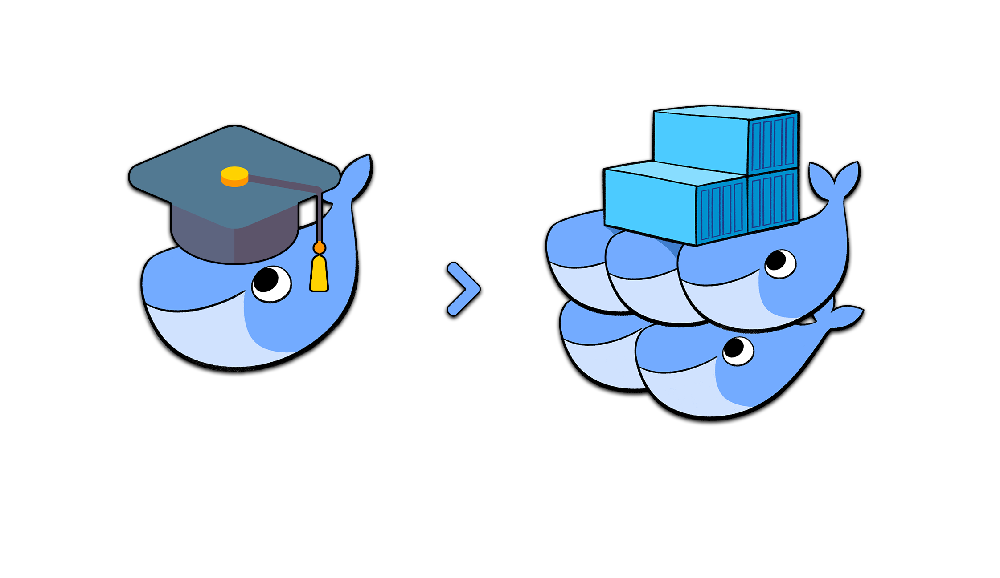

---

# Start a CloudLab experiment

- Go to your CloudLab dashboard
- Click on the Experiments tab
- Select Start Experiment
- Click on Change Profile
  - Select `multi-node-cluster` profile in the `UCY-CS499-DC` project
  - Configure at least two nodes
- Name your experiments with CloudLabLogin-ExperimentName
  - Prevents everyone from picking random names 

---

# Docker Compose: Multi Container Applications

<div class="columns">

<div>

Docker

- Build and run one container at a time
- Manually connect containers together
- Must be careful with dependencies and start  up order


</div>

<div>

Docker Compose
- Define multi container app in `docker-compose.yml` file
- Single command to deploy entire app
- Handles container dependencies
<!-- - Works with Docker Swarm, Networking, Volumes, Universal Control Plane -->


</div>

</div>

---

# Deploying a multi-container application


---

# docker-compose.yml

<div class="columns">

<div>

```yaml
version: "3"

services:
  web:
    image: localhost:5000/web
    build: .
    deploy:
      mode: replicated
      replicas: 1
    ports:
      - "8000"
    restart: always
  redis:
    image: redis:alpine
    restart: always
  nginx:
    image: nginx:latest
    volumes:
      - ./nginx.conf:/etc/nginx/nginx.conf:ro
    depends_on:
      - web
    ports:
      - 8080:8080
    restart: always
```

</div>

<div>

- Defines 3 services to run as containers

  - `nginx`: Load balancer based on NGINX
  - `web`: Web server replying with a hello world message
  - `redis`: Data store maintaining web-server state
</div>

</div>

---

# docker-compose.yml: `web` service

<div class="columns">

<div>

```yaml
web:
  image: localhost:5000/web
  build: .
  ports:
    - "8000"
  restart: always
```

</div>

<div>

- `build`: Specifies the directory containing the Dockerfile 
- `image`: Specifies the image to start the container from. Names the built image with the specified name.
- `ports`: exposes specified container ports

</div>

</div>

---

# Deploying the application

Run our app:

```
$ docker-compose up
```

```
Creating scaledemo_web_1   ... done
Creating scaledemo_redis_1 ... done
Creating scaledemo_nginx_1 ... done
...
redis_1  | 1:C 29 Dec 2023 08:04:46.807 * oO0OoO0OoO0Oo Redis is starting oO0OoO0OoO0Oo
web_1    |  * Running on all addresses (0.0.0.0)
...
```

---

# Testing the application

Check that the application is running with `docker compose ps`:

```
Name                Command                          State   Ports
-------------------------------------------------------------------------------------------
scaledemo_nginx_1   nginx -g daemon off;             Up      80/tcp, 0.0.0.0:8080->8080/tcp
scaledemo_redis_1   docker-entrypoint.sh redis ...   Up      6379/tcp
scaledemo_web_1     python app.py                    Up      0.0.0.0:32857->8000
```

Test the application with `curl`:

```
$ curl http://node0:8080
Hello World from container 60c3761497bf ! I have been seen 1 times.
```

Bring the app down:

```
$ docker compose down --volumes
```
---

# Scaling the application

Scale the `web` service by starting two container instances: 

```
docker-compose up --scale web=2
```

Test the application with `curl`:

```
$ curl http://node0:8080
Hello World from container 52a4a785dd29 ! I have been seen 1 times.

$ curl http://node0:8080
Hello World from container 17f526823085 ! I have been seen 1 times.
```

The load balancer round robins requests among web service instances, but with Compose, instances run on the same node.

---

# Docker Swarm

---

# Docker Swarm

- Cluster management and container orchestration tool embedded in Docker Engine
- Manages a cluster (swarm) of Docker engines or nodes

- The Docker CLI features three new commands:

  - docker swarm (enable Swarm mode; join a Swarm; adjust cluster parameters)

  - docker node (view nodes; promote/demote managers; manage nodes)

  - docker service (create and manage services)

---

# Creating our first Swarm

- The cluster is initialized with `docker swarm init`

- This should be executed on a first, seed node

- DO NOT execute docker swarm init on multiple nodes!
  You would have multiple disjoint clusters.
- Create our cluster from `node0`:
  
  ```
  docker swarm init
  ```
  
  If Docker tells you that it could not choose an IP address to advertise, pick an address which is reachable by every other node of the Swarm:

  ```
  docker swarm init --advertise-addr 10.10.1.1
  ```

---

# Token generation


- In the output of `docker swarm init`, we have a message confirming that our node is now the (single) manager:

  ```
  Swarm initialized: current node (ap1w...) is now a manager.
  ```

- Docker generated two security tokens (like passphrases or passwords) for our cluster

- The CLI shows us the command to use on other nodes to add them to the cluster using the "worker" security token:

  ```
  To add a worker to this swarm, run the following command:
  docker swarm join \
  --token SWMTKN-1-344glh9yboz8g8f7t8co37rewjxr3u8vl2... \
  10.10.1.1:2377
  ```

---

# Checking that Swarm mode is enabled

- Run the traditional docker info command:

  ```
  docker info
  ```

  The output should include:


  ```
  Swarm: active
    NodeID: dxn1zf6l61qsb1josjja83ngz
    Is Manager: true
    ...
  ```

---

# Running our first Swarm mode command

- List the nodes (well, the only node) of our cluster:

  ```
  docker node ls
  ```

  The output should look like the following:

  ```
  ID             HOSTNAME  STATUS  AVAILABILITY  MANAGER STATUS
  dxn1...3ngz *  node1     Ready   Active        Leader
  ```

---

# Adding nodes to the Swarm

- A cluster with one node is not a lot of fun

- Let's add `node1`!

- We need the token that was shown earlier

- You wrote it down, right?

- Don't panic, we can easily see it again 😏

---

# Adding nodes to the Swarm

- Show the token again:

  ```
  docker swarm join-token worker
  ```

- Log into node1:

  ```
  ssh node1
  ```

- Copy paste the `docker swarm join ...` command
  (that was displayed just before)

---

# Check that the node was added correctly

- Stay logged into node2!
- We can still use docker info to verify that the node is part of the Swarm:

  ```
  docker info | grep ^Swarm
  ```

- However, Swarm commands will not work; try, for instance:

  ```
  docker node ls
  ```

- This is because the node that we added is currently a worker

- Only managers can accept Swarm-specific commands

---

# View our two-node cluster

- Let's go back to `node0` and see what our cluster looks like

- Logout from `node1` (with exit or Ctrl-D or ...)

- View the cluster from `node0`, which is a manager:

  ```
  docker node ls
  ```

  The output should be similar to the following:

  ```
  ID             HOSTNAME  STATUS  AVAILABILITY  MANAGER STATUS
  dxn1...3ngz *  node0     Ready   Active        Leader
  9j68...7a7j    node1     Ready   Active
  ```

---

# Our app on Swarm

---

# Our app on Swarm

In this part, we will cover:

- building images for our app,

- shipping those images with a registry,

- running them through the services concept

---

# Why do we need to ship our images?

- When we do `docker-compose up`, images are built for our services

- Those images are present only on the local node

- We need those images to be distributed on the whole Swarm

- The easiest way to achieve that is to use a Docker registry

- Once our images are on a registry, we can reference them when creating our services

---

# Deploying a local registry

- We will create a single-instance service, publishing its port on the whole cluster

- Create the registry service:

  ```
  docker service create --name registry --publish 5000:5000 registry:2
  ```

- Try the following command, until it returns {"repositories":[]}:

  ```
  curl localhost:5000/v2/_catalog
  ```

  (Retry a few times, it might take 10-20 seconds for the container to be started. Patience.)

---

# Build, tag, and push our application container images

- Docker Compose to the rescue!

- Run the following command:
 
  ```
  docker-compose push
  ```

---

# Deploying the stack to the swarm

- Deploy the stack:

  ```
  $ docker stack deploy --compose-file docker-compose.yml scaledemo
  ```

- Check the stack:

  ```
  docker stack services scaledemo
  ```

  ```
  ID             NAME              MODE         REPLICAS   IMAGE                       PORTS
  q4sd4vw6aila   scaledemo_nginx   replicated   1/1        nginx:latest                *:8080->8080/tcp
  hcm2okggpekb   scaledemo_redis   replicated   1/1        redis:alpine                
  2hevpxdgn1iy   scaledemo_web     replicated   1/1        localhost:5000/web:latest   *:30000->8000/tcp
  ```

- Test the app with `curl`:

  ```
  $ curl http://node0:8080
  Hello World from container 22f902bba827 ! I have been seen 1 times.
  ```

---

# Scaling the stack 

- We can change scaling parameters with docker: 

  ```
  $ docker service scale scaledemo_web=2

  scaledemo_web scaled to 2
  ```

- Check the result:

  ```
  $ docker service ps scaledemo_web

  ID             NAME              IMAGE                       NODE    DESIRED STATE   CURRENT STATE
  imsq7y4nwxdl   scaledemo_web.1   localhost:5000/web:latest   node1   Running         Running 7 minutes ago
  3t0rzj84f1vm   scaledemo_web.2   localhost:5000/web:latest   node0   Running         Running about a minute ago
  ```

---

# Scaling the stack 

- Test the application with `curl`:

  ```
  $ curl http://node0:8080
  Hello World from container c91bb0d390dc ! I have been seen 1 times.

  $ curl http://node0:8080
  Hello World from container 22f902bba827 ! I have been seen 2 times.
  ```

---

# HTTP Benchmarking with `wrk`

---

# `wrk`

- Modern HTTP benchmarking tool

- Measures the latency of your HTTP services at high loads

---

# Building `wrk` from source

```
git clone https://github.com/wg/wrk.git
cd wrk
make -j
```

Note: Use `-j` for parallel build

---

# Benchmarking our app

<div class="columns">

<div>


  
</div>

<div>

- Cluster machines running `nginx`, `web`, and `redis`

- Benchmarking machine `node1` running `wrk`
  
</div>

</div>

---

# Run a simple benchmark test

<div class="columns">

<div>

```
wrk -t2 -c6 -d5s --timeout 2s http://node0:8080/
```

Which means:

- `-t2`: Use two separate threads
- `-c6`: Open six connections (the first client is zero)
- `-d5s`: Run the test for five seconds
- `--timeout 2s`: Define a two-second timeout
- `--latency`: Print latency statistics  
- `http://node1/`: The target application is listening on `node1`
- Benchmark the `/` path of our application
  
</div>

<div>


</div>

</div>

---

# Sample output

```
Running 5s test @ http://node0:8080/
  2 threads and 6 connections
  Thread Stats   Avg      Stdev     Max   +/- Stdev
    Latency    10.79ms    1.78ms  31.40ms   78.05%
    Req/Sec   279.02     19.10   350.00     83.00%
  Latency Distribution
     50%   10.71ms
     75%   11.62ms
     90%   12.64ms
     99%   15.57ms
  2782 requests in 5.00s, 635.73KB read
Requests/sec:    555.92
Transfer/sec:    127.04KB
```

---

# Evaluate application scalability

- Use `docker service scale` to change the number of web service instances, ranging from 1 to 8 instances

- For each configuration, use `wrk` to measure throughput and response latency

- You can use `docker stats` to inspect the resource utilization of your containers
