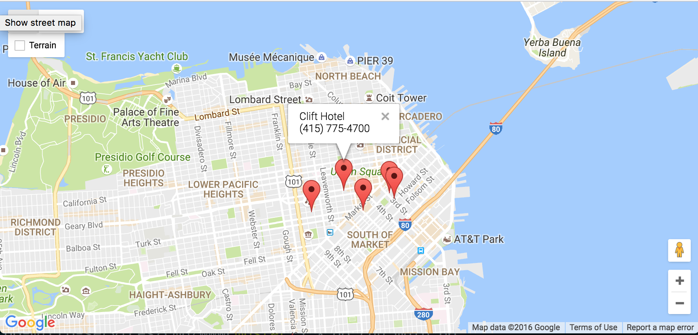
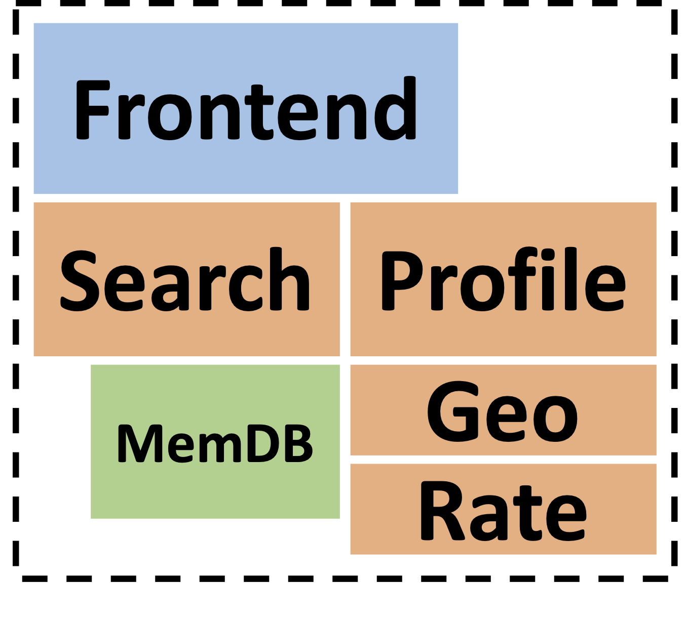
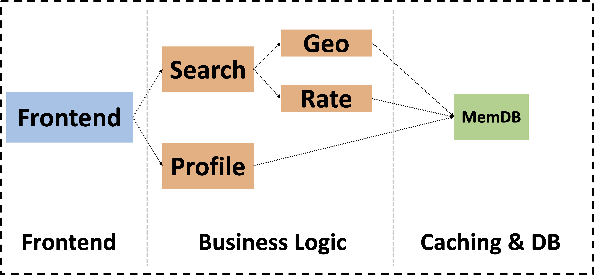
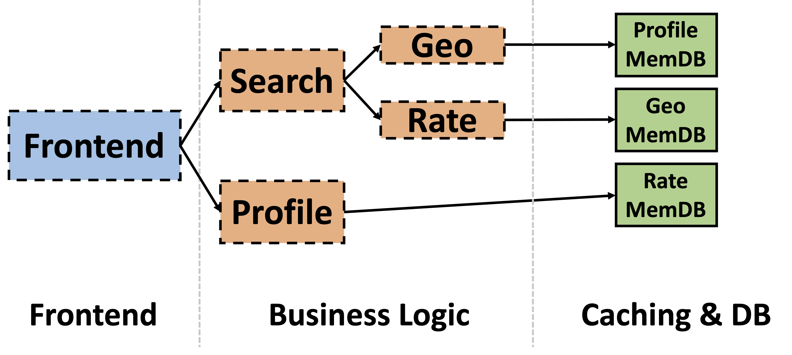
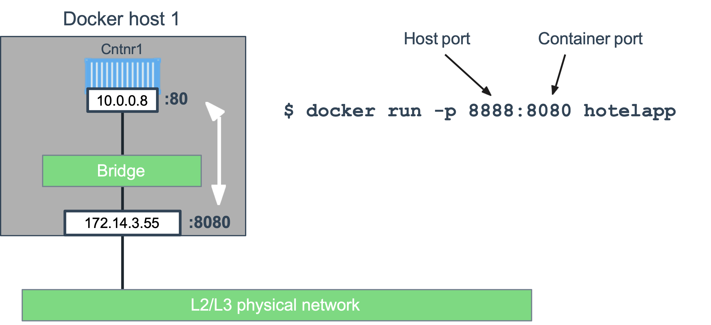

# What sort of language is Go?

- Earliest announcements: "A systems language."
- This confused people

- Doesn't matter! Go is a good general-purpose language that happens to be fun and fast, scalable and efficient

- A great combination for writing lots of things, including
  - systems like web servers...
    - such as this one...

---

# Hotel Map

<div class="columns">

<div>

- Core functionality
  - Plots hotel locations on a Google map
&nbsp;

- Lab work  
  - You will first implement a monolith
  - You will then gradually refactor the monolith towards a microservices architecture

</div>

<div>



</div>

</div>

---

# Monolithic architecture

<div class="columns">

<div>

### All the app components are tightly coupled into a single binary (monolith)

Components
- `frontend` exposes an HTTP server to serve the website
- `search` finds nearby hotels available during given time periods
- `geo` provides all hotels within a given distance
- `profile` returns the profile for a given hotel
- `rate` returns rates for hotels available during given time periods
</div>

<div>



<div class="small center">Hotel Map monolith </div>



<div class="small center">Components organized into three logical tiers </div>
<div class="small center">(dotted arrow lines show local function calls) </div>

</div>

</div>

---

# Microservices architecture

<div class="columns">

<div>

### Each app component runs as a separate microservice

Microservices
- `frontend` exposes an HTTP server to serve the website
- `search` finds nearby hotels available during given time periods
- `geo` provides all hotels within a given distance
- `profile` returns the profile for a given hotel
- `rate` returns rates for hotels available during given time periods
</div>

<div>



<div class="small center">Microservices organized into three logical tiers</div>
<div class="small center">(solid arrow lines show remote communication) </div>

</div>

</div>

---

# Introducing the `net/http` Package

---
# HTTP Basics

<div class="columns">

<div>

Protocol to transport HTML documents from a server to a client web browser

Client browser makes an HTTP *Request* with some information

Server processes that *Request* and returns a *Response*.

</div>

<div>


</div>

</div>

---

# Hello, web

The http package provides the basics for serving web pages

```go
package main

import (
    "fmt"
    "log"
    "net/http"
)

func main() {
    http.HandleFunc("/", handler)
    log.Fatal(http.ListenAndServe(":8080", nil))
}

func handler(w http.ResponseWriter, r *http.Request) {
    fmt.Fprintf(w, "Hello, %s!", r.URL.Path[1:])
}
```

---

# Hello, web

Build and run our web app:

```bash
$ go run hello.go
```

Visit the URL:

```
curl http://localhost:8080/web
```

Should get a page containing:

```
Hello, web!
```

---

# Creating the Hotel Map Web App

---

# Skeleton implementation

Get the code:

```
$ git clone git@github.com:ucy-coast/hotel-app.git
$ cd hotel-app
```

Directory structure follows the [Standard Go Project Layout](https://github.com/golang-standards/project-layout)

- `/cmd`: contains the main application
- `/internal`: contains the private application and library code
- `/pkg`: contains library code that's ok to use by external applications
- `/test`: contains additional external test apps and test data
- `/tools`: contains supporting tools

---

# Plot hotel locations using Google Maps JavaScript API 

Add the following to `internal/frontend/static/index.html`

```html
<!DOCTYPE html>
<html lang="en">
<head>
  <meta charset="UTF-8">
  <meta name="viewport" content="width=device-width, initial-scale=1.0">
  <title>Hotels</title>
  <link rel="stylesheet" href="https://cdn.jsdelivr.net/gh/openlayers/openlayers.github.io@master/en/v6.2.1/css/ol.css" type="text/css">
  <style>
    #map {
      width: 100%;
      height: 400px;
    }
    .tooltip {
      position: absolute;
      background-color: rgba(255, 255, 255, 0.8);
      padding: 4px;
      border-radius: 4px;
      box-shadow: 0 2px 4px rgba(0, 0, 0, 0.1);
      pointer-events: none;
      width: 200px; /* Set the width as needed */
    }    
  </style>
</head>
<body>
  <div id="map"></div>

  <div id="tooltip" class="tooltip"></div>

  <script src="https://cdn.jsdelivr.net/gh/openlayers/openlayers.github.io@master/en/v6.2.1/build/ol.js"></script>
  <script>
    // Calculate the center of the area to zoom into
    // using San Francisco center coordinates
    var centerCoordinates = [-122.4005,37.7854]; 
    var center = ol.proj.fromLonLat(centerCoordinates);

    // Create a vector source with a URL to the GeoJSON file containing points
    var vectorSource = new ol.source.Vector({
      url: "/hotels?inDate=2015-04-09&outDate=2015-04-10&lat=37.7749&lon=-122.4194",
      format: new ol.format.GeoJSON(),
    });

    // Define the style for the points (red color)
    var style = new ol.style.Style({
      image: new ol.style.Circle({
        radius: 6,
        fill: new ol.style.Fill({ color: 'red' }),
        stroke: new ol.style.Stroke({ color: 'white', width: 2 }),
      }),
    });

    // Create a vector layer
    var vectorLayer = new ol.layer.Vector({
      source: vectorSource,
      style: style
    });

    // Create a map
    var map = new ol.Map({
      target: 'map',
      layers: [
        new ol.layer.Tile({
          source: new ol.source.OSM(),
        }),
        vectorLayer,
      ],
      view: new ol.View({
        center: center, // Center the map at the equator and prime meridian
        zoom: 12, // Initial zoom level
      }),
    });

    // Add a tooltip overlay
    var tooltip = new ol.Overlay({
      element: document.getElementById('tooltip'),
      offset: [10, 0],
      positioning: 'bottom-left',
    });
    map.addOverlay(tooltip);

    // Show tooltip on pointer move
    map.on('pointermove', function (event) {
      var feature = map.forEachFeatureAtPixel(event.pixel, function (feature) {
        return feature;
      });
      if (feature) {
        var properties = feature.getProperties();
        var content = properties['name'] + '<br>';
        content += properties['phone_number'] + '<br>';
        tooltip.setPosition(event.coordinate);
        tooltip.getElement().innerHTML = content;        
        tooltip.getElement().style.display = 'block';
      } else {
        tooltip.getElement().style.display = 'none';
      }
    });

    // Hide tooltip on map click
    map.on('click', function () {
      tooltip.getElement().style.display = 'none';
    });    
  </script>
</body>
</html>
```

---

# Build the web server

Fill in the `Run` function, in `services/frontend/frontend.go`

```go
func (s *Frontend) Run(port int) error {
	http.Handle("/", http.FileServer(http.Dir("services/frontend/static")))
	http.Handle("/hotels", http.HandlerFunc(s.searchHandler))
	return http.ListenAndServe(fmt.Sprintf(":%d", port), nil)
}
```

In this code, you:

- Call `http.FileServer` to build a `http.Handler` that serves the entire public directory

- Call `http.HandlerFunc` to build a `http.Handler` that handles the `/hotels` route 

- Call `http.ListenAndServe` to start the web server

---

# Implement the searchHandler

Fill in the searchHandler function, in `internal/frontend/frontend.go` 

```go
func (s *Frontend) searchHandler(w http.ResponseWriter, r *http.Request) {
  ...
}
```

In this code, you:

- Implement the standard `http.HandlerFunc` interface
- Get input from the `http.Request` object, including `r.URL` 
- Use the `r.URL` to extract certain predefined query parameters from the request URL
- Use the rest of the web app components to find nearby hotels
- Call `geoJSONResponse` to encode the locations of the hotels into a JSON document
- Construct a response that includes the JSON document

---

# Building

Build the Hotel Map service:

```
$ go mod init github.com/ucy-coast/hotel-app
$ go build -tags memdb ./cmd/...
```

Run the Hotel Map application:

```
$ ./cmd/mono/mono
```

---

# Testing

Visit the public URL:

```
http://amd198.utah.cloudlab.us:8080
```

You should get a web page that plots hotel locations on a Google map:


---

# Benchmarking

Evaluate performance using a synthetic workload

Use a workload generator based on the wrk2 HTTP benchmarking tool

```bash
$ sudo apt-get install luarocks
$ sudo luarocks install luasocket

$ cd wrk2
$ make

$ ./wrk -t2 -c100 -d30s -R2000 -L -s ./scripts/hotel-reservation/mixed-workload_type_1.lua http://127.0.0.1:8080
```

---

# Benchmarking
  
```
Output:

Running 30s test @ http://127.0.0.1:8080/index.html
  2 threads and 100 connections
  Thread calibration: mean lat.: 0.188ms, rate sampling interval: 10ms
  Thread calibration: mean lat.: 0.188ms, rate sampling interval: 10ms
  Thread Stats   Avg      Stdev     99%   +/- Stdev
    Latency   189.65us   80.56us 319.00us   72.88%
    Req/Sec     1.04k    83.30     1.22k    81.84%
  59896 requests in 30.00s, 5.94MB read
Requests/sec:   1996.57
Transfer/sec:    202.78KB
```

---

# Deploying HotelApp with Docker 

---

# Deploying HotelApp with Docker 

We will deploy a container of Hotel Map

You will:

- Write a `Dockerfile`

- Build an image from a `Dockerfile`

- Run your image as a container

---

# Clone the Hotel Map repo

```
$ git clone https://github.com/ucy-coast/cs452-sp24.git
$ cd cs452-sp24/labs/06-hotelapp/hotel-app
```

---

# Write Hotel Map Dockerfile 

```dockerfile
FROM golang:1.18.4

# set a build-time variable 
ARG DB=memdb

# set a working directory for the app
WORKDIR /go/src/github.com/ucy-coast/hotel-app

# copy all the files to the container
COPY . .

# build and install app
RUN go mod init github.com/ucy-coast/hotel-app
RUN go mod tidy
RUN go install -tags ${DB} -ldflags="-s -w" ./cmd/...

# define the port number the container should expose
EXPOSE 8080

# run the command
CMD ["mono"]
```

<!-- ``EXPOSE`` specifies the port number that needs to be exposed

``CMD`` tells the container which command it should run when it is started  -->

---

# Build Hotel Map image

```
$ docker build -t hotelapp .
Step 1/7 : FROM golang:1.18.4
1.18.4: Pulling from library/golang
Digest: sha256:8a62670f5902989319c4997fe21ecae7fe5aaec8ee44e4e663cfed0a3a8172fc
Status: Downloaded newer image for golang:1.18.4
 ---> e3c0472b1b62
Step 2/7 : ARG DB=memdb
...
```

---

# Run Hotel Map container

```
$ docker run -p 8888:8080 hotelapp
time="2022-08-10T13:15:50Z" level=info msg="Start Frontend server. Addr: 0.0.0.0:8080"
```

Exposes port 8080 of the server inside the container externally on port 8888

---

# Docker Bridge Networking and Port Mapping



---

# Visit Hotel Map

```
http://c220g1-030621.wisc.cloudlab.us:8888
```

<span style="font-size: 24px">Note: `c220g1-030621.wisc.cloudlab` is the public URL of `node0`</span>

