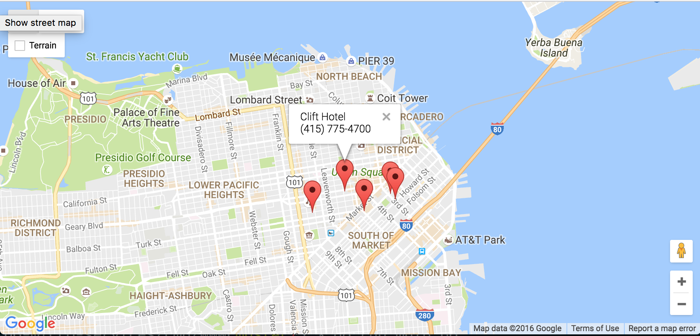

# Hotel Map

<div class="columns">

<div>

- Core functionality
  - Plots hotel locations on a Google map
&nbsp;

- Lab work  
  - You have implemented a monolith
  - You have decomposed the monolith into microservices
  - **Today you will extend the microservices to store data in MongoDB and Memcached**
  
</div>

<div>



</div>

</div>

---

# Storing Hotel Map data in MongoDB

- So far, each service stores its data in JSON flat files under `data/`

- You will extend the `profile` service to store its data in MongoDB 

---

# MongoDB

- Document-oriented database system

  - Data records are stored as BSON documents (binary serialized JSON)

  - Documents are gathered together in collections

---

# Document example


  
---

# Extending the `profile` service implementation

You will

- Establish a connection to MongoDB server
- Define BSON marshalling for data types
- Query data from MongoDB database 

--- 

# Establishing a connection to MongoDB server 

Add the following to `internal/profile/mongodb.go`

```go
func NewDatabaseSession(db_addr string) *DatabaseSession {
  session, err := mgo.Dial(db_addr)
  if err != nil {
    log.Fatal(err)
  }
  log.Info("New session successfull...")

  return &DatabaseSession{
    MongoSession: session,
  }
}
```

---

# Defining BSON marshalling for data types

Add the following to `internal/profile/mongodb.go`

```go
type Hotel struct {
	Id          string   `bson:"id"`
	Name        string   `bson:"name"`
	PhoneNumber string   `bson:"phoneNumber"`
	Description string   `bson:"description"`
	Address     *Address `bson:"address"`
}

type Address struct {
	StreetNumber string  `bson:"streetNumber"`
	StreetName   string  `bson:"streetName"`
	City         string  `bson:"city"`
	State        string  `bson:"state"`
	Country      string  `bson:"country"`
	PostalCode   string  `bson:"postalCode"`
	Lat          float32 `bson:"lat"`
	Lon          float32 `bson:"lon"`
}
```

---

# Querying data from MongoDB collection 

Add the following to `internal/profile/mongodb.go`

```go
func (db *DatabaseSession) GetProfiles(hotelIds []string) ([]*pb.Hotel, error) {
  session := db.MongoSession.Copy()
  defer session.Close()
  c := session.DB("profile-db").C("hotels")

  hotels := make([]*pb.Hotel, 0)

  for _, id := range hotelIds {
          hotel_prof := new(pb.Hotel)
          err := c.Find(bson.M{"id": id}).One(&hotel_prof)
          if err != nil {
                  log.Fatalf("Failed get hotels data: ", err)
          }
          hotels = append(hotels, hotel_prof)
  }
  return hotels, nil
}
```

---

# Defining MongoDB service with Docker Compose

Add the following to `docker-compose.yml`

<div class="columns">

<div>

```yaml
services:
  frontend:
  ...
  mongodb-profile:
    image: mongo
    container_name: 'hotel_app_profile_mongo'
    ports:
      - "27018:27017"
    restart: always
    volumes:
      - profile:/data/db
    ...
volumes:
  profile:
```

</div>

<div>

- Named volume `profile` persists the container directory `/data/db`

</div>

</div>

---

# Defining MongoDB service with Kubernetes

Requires defining

- Deployment
- Service
- PersistentVolume (piece of storage in the cluster)
- PersistentVolumeClaim (request for storage)

---

# Defining MongoDB service with Kubernetes

<div class="columns">

<div style="font-size: 20px">

Deployment

```yaml
apiVersion: apps/v1
kind: Deployment
  ...
  ...
    spec:
      containers:
        - image: mongo
          name: hotel-app-profile-mongo
          ports:
            - containerPort: 27017
          resources:
            limits:
              cpu: 1000m
          volumeMounts:
            - mountPath: /data/db
              name: profile
      hostname: profile-db
      restartPolicy: Always
      volumes:
        - name: profile
          persistentVolumeClaim:
            claimName: profile-pvc
status: {}
```

</div>

<div style="font-size: 20px">

Service


```yaml
apiVersion: v1
kind: Service
metadata:
  labels:
    io.kompose.service: mongodb-profile
  name: mongodb-profile
spec:
  ports:
    - name: "27018"
      port: 27018
      targetPort: 27017
  selector:
    io.kompose.service: mongodb-profile
status:
  loadBalancer: {}
```

</div>

</div>

---

# Defining MongoDB service with Kubernetes

<div class="columns">

<div style="font-size: 20px">

PersistentVolume

```yaml
apiVersion: v1
kind: PersistentVolume
metadata:
  name: profile-pv
spec:
  volumeMode: Filesystem
  accessModes:
    - ReadWriteOnce
  capacity:
    storage: 1Gi
  storageClassName: profile-storage
  hostPath:
    path: /local/volumes/profile-pv
    type: Directory
```

</div>

<div style="font-size: 20px">

PersistentVolumeClaim

```yaml
apiVersion: v1
kind: PersistentVolumeClaim
metadata:
  name: profile-pvc
spec:
  accessModes:
    - ReadWriteOnce
  storageClassName: profile-storage
  resources:
    requests:
      storage: 1Gi
```

</div>

</div>