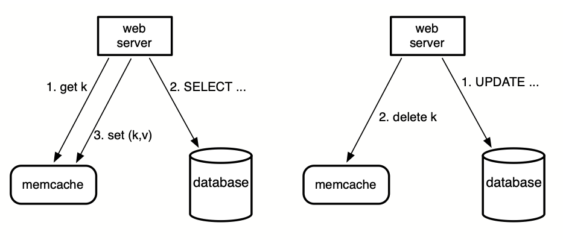

# Hotel Map

<div class="columns">

<div>

- Core functionality
  - Plots hotel locations on a Google map
&nbsp;

- Lab work  
  - You have implemented a monolith
  - You have decomposed the monolith into microservices
  - **Today you will extend the microservices to store data in MongoDB and Memcached**
  
</div>

<div>


</div>

</div>

---

# Caching Hotel Map Data with Memcached

Use Memcached to 

- Alleviate the pressure of the MongoDB database

- Improve the response speed of the application

---

# Using Memcached as demand-filled look-aside cache



---

# Extending `GetProfiles`

<div class="columns">

<div>

```go
for _, i := range hotelIds {
	// first check memcached
	item, err := s.MemcClient.Get(i)
	if err == nil {
		// memcached hit
		hotel_prof := new(pb.Hotel)
		if err = json.Unmarshal(item.Value, hotel_prof); err != nil {
			log.Warn(err)
		}
		hotels = append(hotels, hotel_prof)

	} else if err == memcache.ErrCacheMiss {
			// memcached miss, set up mongo connection
			session := s.MongoSession.Copy()
			defer session.Close()
			c := session.DB("profile-db").C("hotels")
			...
			// write to memcached
			err = s.MemcClient.Set(&memcache.Item{Key: i, Value: []byte(memc_str)})
			if err != nil {
				log.Warn("MMC error: ", err)
			}
		} else {
			fmt.Printf("Memcached error = %s\n", err)
			panic(err)
		}
}
```

</div>

<div>

- Query the memcached server for each hotel by calling `Get`

- In case of a memcached miss
  - Retrieve the item from MongoDB
  - Write the item into Memcached by calling `Set` 

</div>

</div>

---

# Defining Memcached service with Docker Compose

Add the following to `docker-compose.yml`

```yaml
services:
  frontend:
  ...
  memcached-profile:
    image: memcached
    container_name: 'hotel_app_profile_memc'
    restart: always
    environment:
      - MEMCACHED_CACHE_SIZE=128
      - MEMCACHED_THREADS=2
    logging:
      options:
        max-size: 50m
```

---

# Defining MongoDB service with Kubernetes

Look at the provided YAML manifests