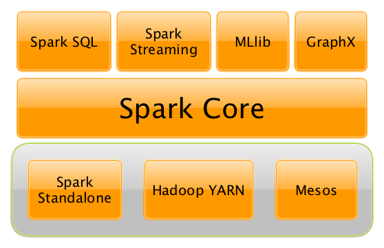

# Lab: Learning Apache Spark

This tutorial provides a quick introduction to using Spark.

## Background

[Apache Spark](https://spark.apache.org/) is an open-source distributed general-purpose cluster computing framework with (mostly) in-memory data processing engine that can do ETL, analytics, machine learning and graph processing on large volumes of data at rest (batch processing) or in motion (streaming processing) with rich concise high-level APIs for the programming languages: Scala, Python, Java, R, and SQL.

<figure>
  <p align="center"></p>
  <figcaption><p align="center"><b>Figure</b>. Apache Spark includes Spark Core and the accompanying Spark Application Frameworks (Source: <a href="https://books.japila.pl/apache-spark-internals/">The internals of Apache Spark</a>)</p></figcaption>
</figure>

### Application model

At a high level, every Spark application consists of a driver program that runs the user’s main function and executes various parallel operations on a cluster. The main abstraction Spark provides is a [resilient distributed dataset (RDD)](https://spark.apache.org/docs/latest/rdd-programming-guide.html#resilient-distributed-datasets-rdds), which is a collection of elements partitioned across the nodes of the cluster that can be operated on in parallel. RDDs are created by starting with a file in the Hadoop file system (or any other Hadoop-supported file system), or an existing Scala collection in the driver program, and transforming it. Users may also ask Spark to persist an RDD in memory, allowing it to be reused efficiently across parallel operations. Finally, RDDs automatically recover from node failures.

In contrast to Hadoop’s two-stage disk-based [MapReduce](https://en.wikipedia.org/wiki/MapReduce) computation engine, Spark's multi-stage in-memory computing engine allows for running most computations in memory, and hence most of the time provides better performance for certain applications, e.g. iterative algorithms or interactive data mining.

### Execution Model

Spark applications run as independent sets of processes on a cluster, coordinated by the [SparkContext](https://spark.apache.org/docs/1.6.0/api/java/org/apache/spark/SparkContext.html) object in your main program (called the driver program).

Specifically, to run on a cluster, the SparkContext can connect to several types of cluster managers (either Spark’s own standalone cluster manager, [Mesos](http://mesos.apache.org/) or [YARN](https://hadoop.apache.org/docs/current/hadoop-yarn/hadoop-yarn-site/YARN.html)), which allocate resources across applications. Once connected, Spark acquires executors on nodes in the cluster, which are processes that run computations and store data for your application. Next, it sends your application code (defined by JAR or Python files passed to SparkContext) to the executors. Finally, SparkContext sends tasks to the executors to run.

<figure>
  <p align="center"></p>
  <figcaption><p align="center"><b>Figure</b>. Cluster mode overview (Source: <a href="https://spark.apache.org/docs/latest/cluster-overview.html">Apache Spark Documentation</a>)</p></figcaption>
</figure>

## Creating a Spark Test Cluster on CloudLab
If you already have a Spark cluster that you will use, you can skip this section. Otherwise, please, start a new experiment on CloudLab using the ``spark-bare-metal`` profile in the `UCY-CS499-DC` project.

## Connecting to the Spark Test Cluster
Connect via SSH to any node of the Spark cluster with your CloudLab credentials. For example: 

```
$ ssh -p 22 alice@hp188.utah.cloudlab.us
```

To verify the installation, run the following command in your terminal:

```
$ spark-shell
```

You should see output similar to the following:

```
21/09/09 07:58:34 WARN NativeCodeLoader: Unable to load native-hadoop library for your platform... using builtin-java classes where applicable
Using Spark's default log4j profile: org/apache/spark/log4j-defaults.properties
Setting default log level to "WARN".
To adjust logging level use sc.setLogLevel(newLevel). For SparkR, use setLogLevel(newLevel).
Spark context Web UI available at http://master-link-0:4040
Spark context available as 'sc' (master = local[*], app id = local-1631195919163).
Spark session available as 'spark'.
Welcome to
      ____              __
     / __/__  ___ _____/ /__
    _\ \/ _ \/ _ `/ __/  '_/
   /___/ .__/\_,_/_/ /_/\_\   version 2.4.5
      /_/

Using Scala version 2.11.12 (OpenJDK 64-Bit Server VM, Java 1.8.0_292)
Type in expressions to have them evaluated.
Type :help for more information.

scala>
```

## Interactive Analysis with the Spark Shell

### Basics

Spark’s shell provides a simple way to learn the API, as well as a powerful tool to analyze data interactively. It is available in either Scala (which runs on the Java VM and is thus a good way to use existing Java libraries) or Python. Start it by running the following in the Spark directory:

```
$ spask-shell
```

Spark’s primary abstraction is a distributed collection of items called a Dataset. Datasets can be created from Hadoop InputFormats (such as HDFS files) or by transforming other Datasets. Let’s make a new Dataset from the text of the README file in the Spark source directory:

```Scala
scala> val textFile = spark.read.textFile("YOUR_SPARK_HOME/README.md")
textFile: org.apache.spark.sql.Dataset[String] = [value: string]
```

Note that you’ll need to replace ``YOUR_SPARK_HOME`` with the location where Spark is installed. For example: ``/usr/local/spark``

You can get values from Dataset directly, by calling some actions, or transform the Dataset to get a new one. For more details, please read the [API doc](https://spark.apache.org/docs/latest/api/scala/org/apache/spark/sql/Dataset.html).

```Scala
scala> textFile.count() // Number of items in this Dataset
res0: Long = 126 // May be different from yours as README.md will change over time, similar to other outputs

scala> textFile.first() // First item in this Dataset
res1: String = # Apache Spark
```

Now let’s transform this Dataset into a new one. We call filter to return a new Dataset with a subset of the items in the file.

```Scala
scala> val linesWithSpark = textFile.filter(line => line.contains("Spark"))
linesWithSpark: org.apache.spark.sql.Dataset[String] = [value: string]
```

We can chain together transformations and actions:

```Scala
scala> textFile.filter(line => line.contains("Spark")).count() // How many lines contain "Spark"?
res3: Long = 15
```

### More on Dataset Operations

Dataset actions and transformations can be used for more complex computations. Let’s say we want to find the line with the most words:

```Scala
scala> textFile.map(line => line.split(" ").size).reduce((a, b) => if (a > b) a else b)
res4: Long = 15
```

This first maps a line to an integer value, creating a new Dataset. reduce is called on that Dataset to find the largest word count. The arguments to map and reduce are Scala function literals (closures), and can use any language feature or Scala/Java library. For example, we can easily call functions declared elsewhere. We’ll use Math.max() function to make this code easier to understand:

```Scala
scala> import java.lang.Math
import java.lang.Math

scala> textFile.map(line => line.split(" ").size).reduce((a, b) => Math.max(a, b))
res5: Int = 15
```

One common data flow pattern is MapReduce, as popularized by Hadoop. Spark can implement MapReduce flows easily:

```Scala
scala> val wordCounts = textFile.flatMap(line => line.split(" ")).groupByKey(identity).count()
wordCounts: org.apache.spark.sql.Dataset[(String, Long)] = [value: string, count(1): bigint]
```

Here, we call flatMap to transform a Dataset of lines to a Dataset of words, and then combine groupByKey and count to compute the per-word counts in the file as a Dataset of (String, Long) pairs. To collect the word counts in our shell, we can call collect:

```Scala
scala> wordCounts.collect()
res6: Array[(String, Int)] = Array((means,1), (under,2), (this,3), (Because,1), (Python,2), (agree,1), (cluster.,1), ...)
```

### Caching

Spark also supports pulling data sets into a cluster-wide in-memory cache. This is very useful when data is accessed repeatedly, such as when querying a small “hot” dataset or when running an iterative algorithm like PageRank. As a simple example, let’s mark our linesWithSpark dataset to be cached:

```Scala
scala> linesWithSpark.cache()
res7: linesWithSpark.type = [value: string]

scala> linesWithSpark.count()
res8: Long = 15

scala> linesWithSpark.count()
res9: Long = 15
```

It may seem silly to use Spark to explore and cache a 100-line text file. The interesting part is that these same functions can be used on very large data sets, even when they are striped across tens or hundreds of nodes. You can also do this interactively by connecting bin/spark-shell to a cluster, as described in the [RDD programming guide](https://spark.apache.org/docs/latest/rdd-programming-guide.html#using-the-shell).

## Self-Contained Applications

Suppose we wish to write a self-contained application using the Spark API. We will walk through a simple application in Scala (with sbt), Java (with Maven), and Python (pip).

We’ll create a very simple Spark application in Scala–so simple, in fact, that it’s named SimpleApp.scala:

```Scala
/* SimpleApp.scala */
import org.apache.spark.sql.SparkSession

object SimpleApp {
  def main(args: Array[String]) {
    val logFile = "YOUR_SPARK_HOME/README.md" // Should be some file on your system
    val spark = SparkSession.builder.appName("Simple Application").getOrCreate()
    val logData = spark.read.textFile(logFile).cache()
    val numAs = logData.filter(line => line.contains("a")).count()
    val numBs = logData.filter(line => line.contains("b")).count()
    println(s"Lines with a: $numAs, Lines with b: $numBs")
    spark.stop()
  }
}
```

Note that applications should define a ``main()`` method instead of extending ``scala.App``. Subclasses of ``scala.App`` may not work correctly.

This program just counts the number of lines containing ‘a’ and the number containing ‘b’ in the Spark README. Note that you’ll need to replace ``YOUR_SPARK_HOME`` with the location where Spark is installed. Unlike the earlier examples with the Spark shell, which initializes its own ``SparkSession``, we initialize a ``SparkSession`` as part of the program.

We call ``SparkSession.builder`` to construct a ``SparkSession``, then set the application name, and finally call getOrCreate to get the SparkSession instance.

Our application depends on the Spark API, so we’ll also include an ``sbt`` configuration file, ``build.sbt``, which explains that Spark is a dependency. This file also adds a repository that Spark depends on:

```
name := "Simple Project"

version := "1.0"

scalaVersion := "2.11.12"

libraryDependencies += "org.apache.spark" %% "spark-sql" % "2.4.5"
```

For sbt to work correctly, we’ll need to layout ``SimpleApp.scala`` and ``build.sbt`` according to the typical directory structure. Once that is in place, we can create a JAR package containing the application’s code, then use the ``spark-submit`` script to run our program.

```bash
# Your directory layout should look like this
$ find .
.
./build.sbt
./src
./src/main
./src/main/scala
./src/main/scala/SimpleApp.scala

# Package a jar containing your application
$ sbt package
...
[info] Packaging {..}/{..}/target/scala-2.12/simple-project_2.11-1.0.jar

# Use spark-submit to run your application
$ YOUR_SPARK_HOME/bin/spark-submit \
  --class "SimpleApp" \
  --master local[4] \
  target/scala-2.12/simple-project_2.11-1.0.jar
...
Lines with a: 46, Lines with b: 23
```

> Note: If sbt is missing, then install sbt using [SDKMAN!](https://sdkman.io/)
> ```
> $ sdk install sbt
> ```
>
> If SDKMAN! is also misssing, then installing SDKMAN! on UNIX-like platforms is as easy as ever. Simply open a new terminal and enter:
>
> ```
> $ curl -s "https://get.sdkman.io" | bash
> ```
> 
> Follow the instructions on-screen to complete installation.
> Next, open a new terminal or enter:
>
> ```
> $ source "$HOME/.sdkman/bin/sdkman-init.sh"
> ```
> 
> Lastly, run the following code snippet to ensure that installation succeeded:
>
> ```
> $ sdk version
> ```
>
> If all went well, the version should be displayed. Something like:
>
> ```
> sdkman 5.0.0+51
> ```

The --master option specifies the master URL for a distributed cluster, or local to run locally with one thread, or local[N] to run locally with N threads. You should start by using local for testing. For a full list of options, run Spark shell with the --help option.

To run on a Spark standalone cluster in client deploy mode:

```bash
$ YOUR_SPARK_HOME/bin/spark-submit \
  --class "SimpleApp" \
  --master spark://10.10.1.1:7077 \
  target/scala-2.12/simple-project_2.11-1.0.jar
...
Lines with a: 46, Lines with b: 23
```

## Acknowledgements

This tutorial is based on the [Apache Spark Quick Start](https://spark.apache.org/docs/latest/quick-start.html).

## References

1. [Intro to Apache Spark](https://stanford.edu/~rezab/sparkclass/slides/itas_workshop.pdf)
2. [Apache Spark Guide](https://docs.cloudera.com/documentation/enterprise/latest/PDF/cloudera-spark.pdf)
